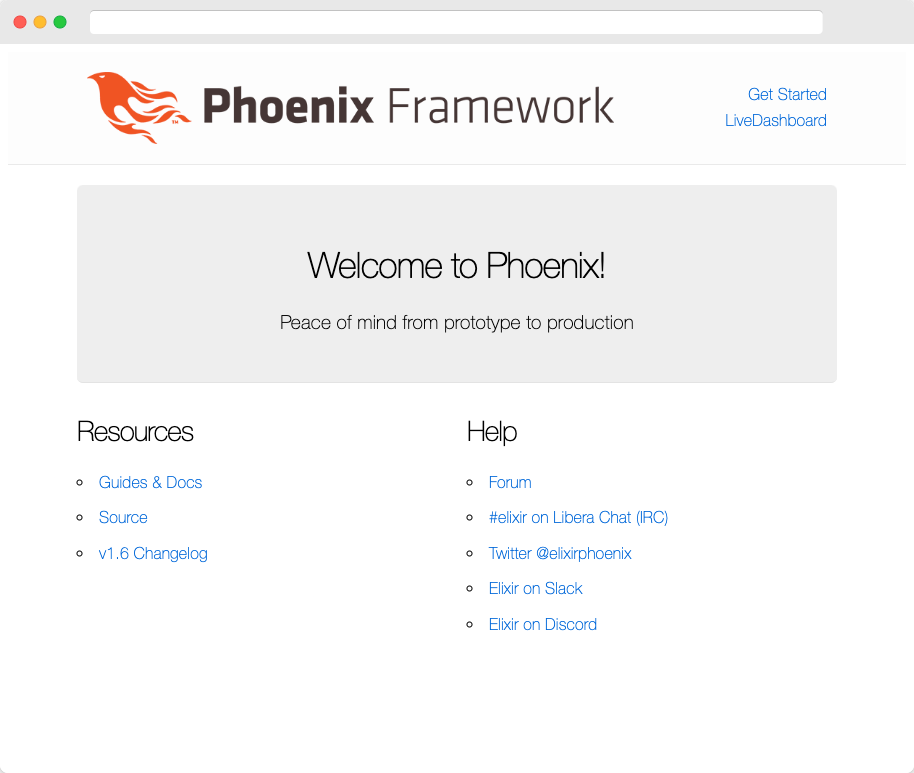

# Elixir + Phoenix

Up and running with Elixir and Phoenix.

[**Elixir**](https://elixir-lang.org/) is a dynamic, functional language for building scalable and maintainable applications.

[**Phoenix**](https://www.phoenixframework.org/) is a web development framework written in Elixir which implements the server-side Model View Controller (MVC) pattern Elixir runs on the Erlang VM, known for creating low-latency, distributed, and fault-tolerant systems.

This repo was creating by followng the Phoenix [Up and Running](https://hexdocs.pm/phoenix/up_and_running.html) guide and the [Ecto](https://hexdocs.pm/phoenix/ecto.html) guide.

### Development
To start your Phoenix server:

  * Install dependencies with `mix deps.get`
  * Create and migrate your database with `mix ecto.setup`
  * Start Phoenix endpoint with `mix phx.server` or inside IEx with `iex -S mix phx.server`

Now you can visit [`localhost:4000`](http://localhost:4000) from your browser.

### Production
Phoenix [deployment guides](https://hexdocs.pm/phoenix/deployment.html).
